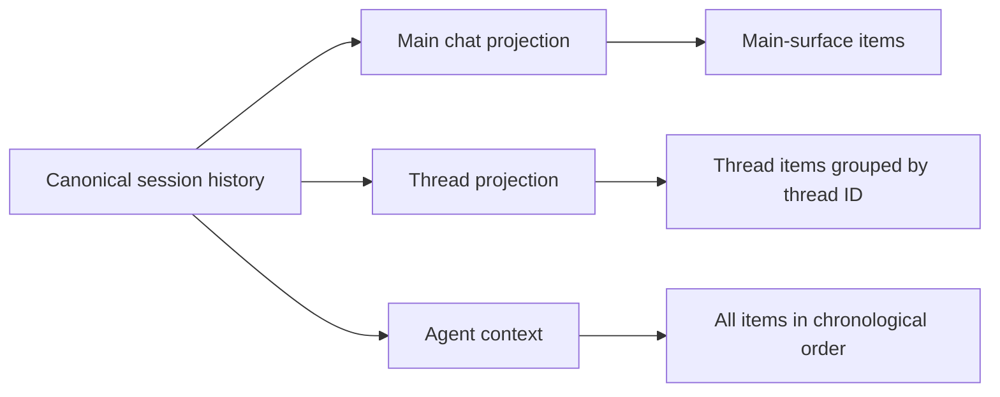
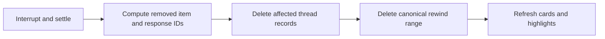

# Design: Batch comments and threaded replies on agent text

- Status: Draft
- Updated: 2026-08-23
- Builds on: the existing agent-text batch comment feature

## 1. Summary

Agent responses support comments anchored to selected, completed agent prose. The
existing behavior is **Batch mode**: users stage several comments, send them to the
agent in one message, and the comments and their highlights disappear after the send
succeeds.

This design adds an independent **Threaded replies** mode. In this mode, each new
comment is sent to the same session immediately as an individual agent turn. The
agent's response streams beneath the user's comment in the Comments sidebar, similar
to a Google Docs comment thread. Thread cards are vertically aligned with their
highlighted source text and the chat and Comments panes scroll in logical
synchronization.

Batch comments and threaded replies are separate systems. They do not share records,
lifecycle, queries, highlights, sending behavior, or panel layout. Switching modes
only selects which system is visible; it never converts, sends, or deletes work from
the other mode.

Thread turns use the same agent and canonical session history as the main chat. Their
thread record stores the canonical response ID, allowing the main ChatPage to exclude
that response while the Comments sidebar displays it. The agent receives both main and
thread turns in their true chronological order.

Batch mode is available for every harness because it uses the existing normal-send
path. Threaded replies are available only for OmniHarness and direct OpenAI Agents SDK
sessions. Every threaded turn executes through OpenAI Agents SDK. In this deployment,
OmniHarness uses OpenAI Agents SDK as its underlying harness, so no per-turn
compatibility analysis or alternative threaded harness integration is required.

## 2. Goals

- Preserve the existing Batch behavior without adding threaded conditionals to its
  persistence or send lifecycle.
- Add a remembered **Threaded replies** toggle to the right of the Comments title,
  defaulting to off.
- Keep Batch comments available for every harness through the existing normal-send
  path.
- Support Threaded replies only for OmniHarness and direct OpenAI Agents SDK sessions,
  with every threaded turn executed by OpenAI Agents SDK.
- Keep an unsupported Threaded toggle attempt in Batch mode and show the failure as
  an inline notice beneath the Comments title.
- Send each threaded comment as one serialized turn to the same session and agent.
- Stream the agent's response beneath the corresponding user comment, without
  duplicating it at the bottom of the main chat.
- Keep one canonical, complete chronological session history across main-chat and
  comment-thread surfaces.
- Restore threads, replies, highlights, and run state after navigation or reload.
- Align open thread cards with their highlighted source passages on desktop.
- Support bidirectional highlight/card navigation and logically synchronized
  chat/sidebar scrolling.
- Keep answered threads and highlights visible until explicitly resolved.
- Preserve resolved thread history in a Resolved view.
- Delete comments and threads whose source agent text is removed by rewind.

## 3. Non-goals

- No conversion between Batch comments and Threaded replies.
- No mixed Batch/Threaded card list or shared Send button.
- No comments on user messages, streaming agent text, reasoning, tool cards, errors,
  or selections spanning multiple agent text items.
- No parallel agent runs within one session; normal turns and thread turns share the
  same serialized session queue.
- No child session per comment.
- No duplication of thread responses in the main-chat surface.
- No synchronized side-by-side scrolling on mobile; mobile uses normal card
  navigation in the Comments drawer.
- No cross-device preference synchronization in v1. The mode preference is local to
  the client.
- No Threaded replies for direct harnesses other than OpenAI Agents SDK; Batch remains
  available for those harnesses.
- No generic threaded integration across native-terminal, Claude SDK, Codex, Pi, or
  other harness adapters in v1.

## 4. Terminology

### User-facing terms

- **Batch mode**: the existing staged-comment workflow.
- **Threaded replies**: the new individually sent, agent-answered workflow.
- **Thread**: one highlighted passage, the user's comment, and the agent's response.
- **Resolve**: remove an answered thread from the active annotation surface without
  deleting its history.

"Inline mode" is avoided because the agent response is not inserted into the main
chat text. It is rendered in a thread in the Comments sidebar.

### Internal terms

```ts
type CommentMode = "batch" | "threaded";

type PresentationSurface = "main" | "comment_thread";
```

## 5. Mode isolation

The two modes own separate data and behavior.

| | Batch mode | Threaded replies |
|---|---|---|
| Persistence | `agent_text_comments` | `agent_text_threads` |
| Query key | `agent-text-comments` | `agent-text-threads` |
| Creation | Save a staged comment | Save and queue one turn |
| Agent delivery | One combined user message | One user turn per thread |
| Agent response | Main chat | Beneath the thread comment |
| Completion | Delete after batch send | Remain until Resolve |
| Layout | Compact stacked cards | Anchor-aligned comment canvas |
| Highlights | Batch highlight registry | Thread highlight registry |
| Footer | `Send N comments` | None |

They may share low-level utilities such as DOM text indexing and range reconstruction,
but they must not share records or lifecycle state.

### Switching modes

Switching the toggle:

- does not convert records;
- does not send anything;
- does not delete anything;
- hides the inactive mode's cards and highlights;
- restores them unchanged when switching back; and
- changes the panel layout and selection action semantics for new comments.

If the inactive mode contains work, its count remains visible near the toggle. A
brief toast may confirm preservation, for example, `3 batch comments are still
saved.`

An unfinished editor is mode-specific. Switching modes while an editor contains text
asks whether to keep editing or discard it; it is never transferred to the other
mode.

## 6. Header and preference

The toggle is to the right of the Comments title.

### Batch mode

```text
┌────────────────────────────────────────────┐
│ Comments (3)       Threaded replies [ OFF ]│
├────────────────────────────────────────────┤
│ Batch comment cards                        │
│                                            │
│                         [Send 3 comments]  │
└────────────────────────────────────────────┘
```

### Threaded replies

```text
┌────────────────────────────────────────────┐
│ Comments (2)       Threaded replies [ ON ] │
│                                            │
│ [ Open 2 ] [ Resolved ]                    │
├────────────────────────────────────────────┤
│ Anchor-aligned thread cards                │
└────────────────────────────────────────────┘
```

Enabling Threaded replies shows no token-cost warning, modal, confirmation dialog, or
toast.

### Unsupported toggle attempt

If the user tries to enable Threaded replies in an unsupported session, the switch
remains off, Batch mode remains active, and an inline error appears beneath the title:

```text
┌─────────────────────────────────────────────┐
│ Comments          Threaded replies    [OFF] │
│ ⚠ Threaded replies require OmniHarness or   │
│   OpenAI Agents SDK.                        │
├─────────────────────────────────────────────┤
│ Batch comment cards                         │
└─────────────────────────────────────────────┘
```

If OpenAI Agents SDK is supported but unavailable on the selected host, use:

> OpenAI Agents SDK isn't configured on this host.

The error remains scoped to the current conversation and clears when the conversation
changes, capability refresh succeeds, or the user explicitly selects Batch. A failed
toggle attempt never updates the remembered preference.

### Preference and effective mode

The preference is global to the current client and defaults to Batch:

```ts
const COMMENT_MODE_STORAGE_KEY = "omnigent:agent-comment-mode:v1";
```

Only `"threaded"` is interpreted as Threaded replies; missing or invalid values fall
back to `"batch"`. Keep the remembered preference separate from the current session's
effective mode:

```ts
const effectiveMode =
  preferredMode === "threaded" && capabilities.threaded.supported
    ? "threaded"
    : "batch";
```

Opening an unsupported session does not overwrite a remembered Threaded preference.
That session falls back to Batch and shows the inline reason; returning to a supported
session restores Threaded mode.

### Capability

Batch mode is supported for every harness and requires only normal session edit
permission. For Threaded replies, the server resolves the bound agent and canonical
effective harness. Threaded mode is supported when either:

- the bound agent is the built-in OmniHarness agent; or
- the canonical effective harness is `openai-agents-sdk`.

OpenAI Agents SDK may appear as `openai-agents` in internal configuration layers; use
`is_omniharness_agent(...)` and the existing harness canonicalization rather than
comparing raw configuration text. The capability also verifies that OpenAI Agents SDK
is available on the selected host.

The Comments rail and Batch Comment action remain fully available on unsupported
threaded harnesses. An attempted Threaded toggle explains the limitation inline and
leaves Batch mode active.

```ts
interface CommentCapabilities {
  batch: {
    supported: boolean; // Normal session edit permission; harness-independent.
    reason?: "read_only_session";
  };
  threaded: {
    supported: boolean;
    reason?: "unsupported_executor" | "openai_sdk_unavailable" | "read_only_session";
  };
}
```

The server is authoritative. The frontend capability is for immediate UX, and every
create/retry endpoint repeats the check. Loading capability keeps the Threaded switch
disabled rather than enabling it optimistically.

## 7. Eligible selections

Both systems use the same eligibility rules.

A selection is commentable only when:

- it is non-empty;
- both endpoints are within the same persisted agent text item;
- the agent item is final; and
- the selection contains agent prose rather than UI chrome.

The Comment action is unavailable for:

- user messages;
- streaming agent text;
- reasoning or process output;
- tool calls and tool results;
- approval or elicitation cards;
- errors and system content; and
- cross-item selections.

The existing popup remains:

```text
[ Reply ] [ Comment ]
```

The selected mode determines the editor.

### Batch editor

```text
Comment

“selected agent text”

[Write a comment…]

                         Cancel  Add
```

### Threaded editor

```text
Threaded comment

“selected agent text”

[Ask about this response…]

                    Cancel  Send comment
```

Batch `Add` stages a record. Threaded `Send comment` creates a durable thread and
queues its agent turn immediately.

## 8. Complete session history

Threaded replies use the same agent and session as the main chat. Main and thread
turns live in one canonical, append-only chronological history.

Example canonical sequence:

```text
1. Main user:    Why does this session wait?
2. Main agent:   The status event is ignored...
3. Thread user:  Why do we ignore this event?
4. Thread agent: It should only be ignored during hydration...
5. Main user:    Can you fix the implementation?
6. Main agent:   Yes, I will update...
```

Presentation is a projection of that history:

- ChatPage renders items 1, 2, 5, and 6.
- The thread anchored to item 2 renders items 3 and 4.
- The agent context sees items 1 through 6 in sequence.



A thread anchored to an older response is appended at the current sequence position;
it is never inserted retroactively next to the source item in storage. The source
anchor controls visual placement only.

```text
source agent item sequence = 20
thread user item sequence   = 105
thread agent item sequence  = 106
```

This preserves correct agent context, rewind boundaries, streaming order, tool
execution order, and session resumability.

### Seeing the full history

The complete user-visible history is available across two projections:

- Main chat shows every main-surface turn.
- Threaded Comments shows every open thread.
- The Resolved tab shows resolved thread history.

Resolving does not delete thread messages. Reopening the session reconstructs both
projections from the canonical history and thread records.

Context compaction may summarize older turns for model input, as it does for normal
chat, but it must not delete persisted thread items or presentation metadata.

## 9. Persistence

### 9.1 Thread anchor and state

Add a dedicated table:

```text
agent_text_threads
  id
  conversation_id
  source_item_id
  start_offset
  end_offset
  selected_text
  prefix_context
  suffix_context
  user_comment
  state
  active_run_id
  failure_message
  resolved_at
  created_at
  updated_at
```

State:

```ts
type AgentTextThreadState =
  | "queued"
  | "running"
  | "answered"
  | "failed"
  | "resolved";
```

The anchor uses UTF-16 rendered-text offsets, matching browser string indexing and
the existing Batch comment implementation.

### 9.2 Canonical response association

Thread turns remain ordinary canonical conversation items. A thread stores the
`user_item_id` and `response_id` assigned by the existing session event path:

```text
agent_text_threads
  ...
  user_item_id
  response_id
```

Every user, assistant, tool, and process item created for that turn already shares the
same response ID. The UI therefore projects history by association rather than adding
presentation columns to every conversation item:

```text
response ID belongs to an agent-text thread → Comments thread surface
all other response IDs                     → main ChatPage surface
```

The full response remains in canonical chronological history and in future agent
context. The main transcript filters the associated response ID, while the thread
panel renders its persisted items and any live blocks carrying that response ID. This
keeps presentation metadata framework-owned without modifying individual harness
event formats.

### 9.3 Resolution

Resolve sets `resolved_at` and state `resolved`. It does not delete:

- the thread record;
- the user thread item;
- the agent response items; or
- their place in canonical history.

Resolved threads lose their highlight and move from Open to Resolved.

## 10. Backend API

A dedicated capability route exposes whether Threaded replies are supported. Batch
comments remain harness-independent. Thread creation, retry, and correlated event
submission repeat the canonical harness allowlist check so a stale client cannot
bypass it.

```text
GET    /sessions/{session_id}/agent-text-threads
POST   /sessions/{session_id}/agent-text-threads
DELETE /sessions/{session_id}/agent-text-threads/{thread_id}
POST   /sessions/{session_id}/agent-text-threads/{thread_id}/retry
POST   /sessions/{session_id}/agent-text-threads/{thread_id}/resolve
```

The list endpoint supports:

```text
?state=open
?state=resolved
```

### 10.1 Create and queue

Request:

```json
{
  "client_request_id": "uuid",
  "source_item_id": "item_123",
  "start_offset": 42,
  "end_offset": 68,
  "selected_text": "status event is ignored",
  "prefix_context": "but the worktree ",
  "suffix_context": " during hydration",
  "comment": "Why do we ignore this event?"
}
```

Submission uses two existing server boundaries:

1. `POST /agent-text-threads` authorizes edit access, checks the Threaded harness
   allowlist, validates the source/anchor, and idempotently creates the queued thread.
2. The dedicated thread mutation posts the formatted user message to the existing
   `POST /events` endpoint with `comment_thread_id`.
3. `/events` repeats the allowlist and thread-state checks, persists the canonical user
   item before forwarding, and binds the thread to that item and its response ID.
4. The existing session queue serializes the turn with normal chat turns.

`client_request_id` makes thread creation idempotent. A stable request ID is retained
while an unfinished draft retries. The event endpoint accepts only a queued, unbound
thread, preventing a duplicate agent turn for an already-submitted thread.

### 10.2 Prompt presented to the agent

The visible user comment remains concise, while the runner sends enough context to be
unambiguous:

```text
Regarding this excerpt from your earlier response:

> status event is ignored

User comment:
Why do we ignore this event?
```

The canonical source response is also already in session context.

### 10.3 Retry

Retry is valid only for a failed thread. It requeues the existing thread request and
does not append a duplicate visible user comment. Retry itself must be idempotent.

### 10.4 Permissions

Reuse session permissions:

- read access lists and views threads;
- edit access creates, retries, resolves, or deletes threads.

The server validates every source item and thread against the route's session ID.

## 11. Session execution and streaming

Both direct OpenAI Agents SDK and OmniHarness sessions execute threaded turns through
OpenAI Agents SDK. OmniHarness main-chat turns retain their normal routing behavior,
but this deployment guarantees OpenAI Agents SDK as its underlying threaded harness.
Direct harnesses other than OpenAI Agents SDK are unsupported in v1.

Normal main-chat turns and thread turns use the same serialized session queue. There
is never more than one active agent run for a session.

If three comments are created rapidly:

```text
Thread A → running
Thread B → queued
Thread C → queued
```

If the main agent is already responding, a new thread is queued behind it. If a
thread is running, a normal main-chat message is queued behind that run. The server,
not the client, owns ordering.

The server binds the thread to the persisted user item and its response ID. All live
blocks and persisted items for that turn already carry that response ID. The frontend
uses the thread query as its presentation index:

```ts
const threadResponseIds = new Set(threads.flatMap(thread =>
  thread.response_id ? [thread.response_id] : [],
));

const mainBlocks = blocks.filter(block => !threadResponseIds.has(block.responseId));
const threadBlocks = blocks.filter(block => block.responseId === thread.response_id);
```

Thread output is therefore not duplicated at the bottom of ChatPage. The thread panel
renders live text from the same block stream, then uses persisted response items after
reload. Main chat may show a small non-content status such as
`Agent is answering a threaded comment…` while the shared session is busy.

## 12. Thread card lifecycle

### Queued

```text
┌─────────────────────────────────────┐
│ “selected text…”                    │
│ Why does this happen?               │
├─────────────────────────────────────┤
│ Queued behind the current response… │
└─────────────────────────────────────┘
```

### Running

```text
┌─────────────────────────────────────┐
│ “selected text…”                    │
│ Why does this happen?               │
├─────────────────────────────────────┤
│ ✦ Agent                             │
│ We ignore this event because▍       │
└─────────────────────────────────────┘
```

### Answered

```text
┌─────────────────────────────────────┐
│ “selected text…”                    │
│ Why does this happen?               │
├─────────────────────────────────────┤
│ ✦ Agent                             │
│ It is ignored only while…           │
│                          ✓ Resolve  │
└─────────────────────────────────────┘
```

### Failed

```text
┌─────────────────────────────────────┐
│ “selected text…”                    │
│ Why does this happen?               │
├─────────────────────────────────────┤
│ Could not send this comment.        │
│                              Retry  │
└─────────────────────────────────────┘
```

### Resolved

Resolved cards appear only in the Resolved tab. They retain the quote, user comment,
and agent response. Clicking one navigates to its source if the source still exists,
but does not restore the highlight. Reopen is a potential follow-up, not required in
v1.

## 13. Highlighting

Only the active mode paints highlights.

Batch keeps its existing yellow registries. Threaded replies use distinct registries:

```text
omnigent-agent-thread
omnigent-agent-thread-active
omnigent-agent-thread-pending
```

Recommended styles:

```css
::highlight(omnigent-agent-thread) {
  background-color: rgba(168, 85, 247, 0.22);
}

::highlight(omnigent-agent-thread-active) {
  background-color: rgba(168, 85, 247, 0.42);
}

::highlight(omnigent-agent-thread-pending) {
  background-color: rgba(59, 130, 246, 0.28);
}
```

- Open thread: purple.
- Active thread: stronger purple.
- Unsaved threaded selection: blue.
- Resolved thread: no highlight.
- Inactive mode: clear that mode's highlight registries.

Range reconstruction reuses the existing rendered-text anchor utilities. It resolves
within the exact source item, validates prefix/suffix context, supports overlapping
matches, and refuses to highlight an ambiguous or incorrect passage.

## 14. Desktop anchor-aligned layout

Batch mode remains a compact list. Only Threaded replies uses a document-aligned
comments canvas.

Each open thread has:

```ts
interface ThreadLayoutEntry {
  threadId: string;
  anchorY: number;
  idealTop: number;
  layoutTop: number;
  cardHeight: number;
  range: Range;
}
```

### 14.1 Measure the source anchor

Use the first non-empty client rect of the reconstructed DOM Range:

```ts
const rect = firstNonEmptyRect(range);
const chatRect = chatScroller.getBoundingClientRect();

const anchorY =
  rect.top -
  chatRect.top +
  chatScroller.scrollTop;
```

`anchorY` is in chat-document coordinates, independent of the current viewport.

### 14.2 Collision packing

Sort open threads by source item sequence, anchor offset, creation time, and ID. The
ideal card top equals `anchorY`, but later cards are pushed down to avoid overlap:

```ts
const GAP = 12;
let previousBottom = 0;

for (const thread of sortedThreads) {
  thread.layoutTop = Math.max(
    thread.anchorY,
    previousBottom + GAP,
  );

  previousBottom = thread.layoutTop + thread.cardHeight;
}
```

The comments canvas height is:

```ts
Math.max(
  chatScroller.scrollHeight,
  lastThread.layoutTop + lastThread.cardHeight + bottomPadding,
);
```

The sidebar may therefore be taller than the main chat.

### 14.3 Expansion

To limit displacement from anchors:

- the active thread is expanded;
- a running thread is expanded;
- inactive answered threads are collapsed;
- queued and failed threads are compact.

Each card uses `ResizeObserver`. Streaming and expansion changes schedule one
measurement/layout pass per animation frame. Relayout preserves the active card's
screen position so content above it can grow without visible jumping.

## 15. Synchronized scrolling

Equal `scrollTop` values are incorrect because thread cards may be much taller than
their source passages. Synchronization uses corresponding points:

```text
chat anchor Y ↔ laid-out thread-card Y
```

Example:

```text
Highlight A: 300  ↔ Thread A: 300
Highlight B: 800  ↔ Thread B: 1,100
Highlight C: 1400 ↔ Thread C: 1,850
```

Between adjacent points, use piecewise-linear interpolation.

### 15.1 Chat to Comments

```ts
commentY = mapChatYToCommentY(chatY);
```

### 15.2 Comments to Chat

```ts
chatY = mapCommentYToChatY(commentY);
```

The reference position is approximately 35% down each viewport:

```ts
const referenceY =
  scroller.scrollTop +
  scroller.clientHeight * 0.35;
```

This keeps corresponding content in a similar visual region.

### 15.3 Feedback-loop prevention

Track which pane currently owns scrolling:

```ts
type ScrollOwner = "chat" | "comments" | null;
```

A user scroll in one pane updates the other; the resulting programmatic event is
ignored. Ownership is released after scroll activity is idle, accounting for
trackpad momentum.

### 15.4 Sidebar below chat bottom

When the comments canvas extends below the chat document:

- the Comments pane continues scrolling;
- the main chat remains pinned at its bottom; and
- synchronized mapping resumes when the Comments pane re-enters the mapped range.

No artificial blank region is added beneath the main conversation.

## 16. Direct navigation

Direct navigation is exact and temporarily overrides passive synchronization.

### Highlight to thread

1. Activate the thread.
2. Open the Comments rail if closed.
3. Select Threaded replies mode.
4. Expand the card.
5. Scroll it to approximately 30% from the top of the sidebar.

### Thread to highlight

1. Activate the thread.
2. Ensure its source history item is loaded.
3. Reconstruct the range.
4. Scroll the highlight to approximately 30% from the top of ChatPage.
5. Paint the active highlight color.

If the source item is outside loaded history, explicit navigation loads older pages
until the exact item appears or history is exhausted. It never navigates by matching
quote text in a different item.

## 17. Mobile behavior

Mobile does not use simultaneous synchronized panes.

- The Comments drawer displays Threaded cards as a normal compact list.
- Clicking a card closes the drawer and scrolls ChatPage to the source highlight.
- Clicking a highlight opens the drawer and scrolls to the card.
- Running and active cards are expanded; other cards may remain collapsed.
- The remembered mode preference is shared with desktop on the same client.

## 18. Rewind and deletion

Rewind is the only operation that removes threaded history rather than merely
resolving it.

The rewind route first interrupts and settles the active session turn. In the same
conversation-store transaction that truncates canonical items, it deletes a thread
when the removed range contains any of:

- its highlighted source item;
- its thread user item; or
- any item carrying its response ID.

This prevents a surviving anchor row from pointing at truncated thread history. Cards
and highlights disappear when the thread query refreshes. Threads whose complete
source and response history precede the rewind boundary survive.



Conversation deletion removes all Batch comments, thread records, and canonical items.

Before an agent answer, Delete cancels queued work where possible and removes the
thread. Deleting a currently running thread requires confirmation. After an answer,
the primary action is Resolve, not Delete.

## 19. Errors and recovery

### Creation fails

Keep the editor and pending highlight. Show the error and allow retry with the same
idempotency key.

### Queue or run fails

Keep the thread and highlight, set state `failed`, and show Retry. Retry cannot append
a duplicate user comment.

### Reload during a run

The server owns canonical queue/run state. Reload queries the thread and its persisted
response items, reconnects to the normal session stream, and routes matching live
blocks to the card by response ID.

### Query fails

Render an explicit error state with Retry, not the empty state.

### Source range cannot resolve

Keep the thread card and quote, but do not highlight unrelated text. Navigation shows
that the source is unavailable rather than falling back to a match in another item.

## 20. Frontend structure

Suggested new modules:

```text
web/src/hooks/useAgentTextThreads.ts
web/src/hooks/useAgentTextThreadHighlights.ts
web/src/hooks/useThreadedCommentLayout.ts
web/src/hooks/useSynchronizedCommentScroll.ts

web/src/shell/AgentTextThreadPanel.tsx
web/src/shell/AgentTextThreadCard.tsx

web/src/lib/commentModePreference.ts
web/src/lib/threadedCommentAnchor.ts
```

The top-level panel selects one independent implementation:

```tsx
function CommentsPanel() {
  const mode = useCommentMode();

  return mode === "batch"
    ? <AgentTextCommentsPanel />
    : <AgentTextThreadPanel />;
}
```

Transient DOM Ranges and measured layout remain in React refs/state and are never
persisted in Zustand or local storage.

## 21. Backend structure

New backend modules:

```text
omnigent/entities/agent_text_thread.py
omnigent/server/routes/agent_text_threads.py
```

Thread persistence belongs to the existing conversation store because thread records,
source items, response items, and rewind truncation must share one database and
transaction. The existing `/events` path remains the only turn queue: its optional
`comment_thread_id` is accepted only for OmniHarness/OpenAI SDK user messages and is
used to bind the synchronously persisted user item and response ID back to the thread.

The OpenAI Agents SDK executor emits ordinary events and needs no sidebar-specific
adapter behavior. Do not route threaded creation through generic `chatStore.send()`
options or native pending-input correlation. In particular, v1 does not add thread
metadata to native `pending_inputs`, delayed external-item binding, or every harness
adapter. This is the main runtime simplification from the OpenAI Agents SDK-only
execution path.

## 22. Implementation sequence

### Phase 1: Capability and mode shell

- Keep Batch capability harness-independent and based on normal session edit access.
- Add server-owned Threaded capability using the built-in OmniHarness/direct OpenAI
  Agents SDK allowlist.
- Add the remembered Batch/Threaded preference and derive a per-session effective
  mode without overwriting the global preference.
- Add the header toggle and inline toggle-failure notice.
- Add Open/Resolved tabs for the Threaded panel shell.
- Keep mode records, counts, drafts, and highlights isolated.
- Preserve inactive-mode work when switching.

### Phase 2: Persistence and canonical history association

- Add `agent_text_threads` in the conversation database.
- Add thread list/create/delete/retry/resolve routes.
- Bind submitted threads to their canonical user item and response ID.
- Project main and thread surfaces by response-ID association.
- Verify reload and complete-history behavior.

### Phase 3: OpenAI Agents SDK execution and streaming

- Submit the formatted thread prompt through the existing `/events` queue with the
  thread ID correlation field.
- Queue every direct-SDK or OmniHarness thread turn through the existing per-session
  ordering mechanism.
- Do not add native pending-input correlation or generic harness-adapter behavior.
- Render matching live response blocks in the Threaded panel and filter the associated
  response from main-chat rendering.
- Add queued/running/answered/failed states and idempotent retry.

### Phase 4: Resolve and rewind

- Add Resolve and Resolved history.
- Add transactional rewind cleanup and cancellation.
- Ignore late events for deleted threads.
- Verify context compaction preserves persisted thread presentation.

### Phase 5: Desktop anchored layout

- Measure source ranges and card heights.
- Add the absolute-positioned comments canvas.
- Add collision packing.
- Add collapsed/expanded behavior and layout stabilization.
- Add exact highlight/card navigation.

### Phase 6: Synchronized scrolling

- Build piecewise chat-to-comments and inverse mappings.
- Add bidirectional synchronization and ownership guards.
- Handle comments-canvas overflow beyond chat bottom.
- Support unloaded older source items.
- Add mobile navigation behavior without synchronized panes.

## 23. Test plan

### Capability, mode isolation, and preference

- Batch is the default.
- Preference survives reload.
- Every harness exposes Batch comments.
- OmniHarness and direct OpenAI Agents SDK sessions also expose Threaded replies.
- Other direct harnesses keep Batch creation, mutation, and sending fully functional;
  the Threaded toggle shows its inline unsupported reason.
- Threaded mode shows no cost notice or modal.
- An unsupported toggle attempt stays in Batch and shows the correct inline error.
- A failed toggle attempt does not update the remembered preference.
- Opening an unsupported session does not erase a remembered Threaded preference.
- Thread create/retry routes reject stale or bypassed unsupported requests.
- Batch records remain unchanged after switching to Threaded.
- Thread records remain unchanged after switching to Batch.
- Only the active mode's cards and highlights are visible.
- No record is converted between modes.
- An unfinished draft cannot be silently lost.

### Selection

- Completed agent prose is eligible.
- User, streaming, reasoning, and tool content is ineligible.
- Cross-item selection is rejected.
- Markdown spanning multiple DOM text nodes produces correct UTF-16 offsets.
- Repeated and overlapping selected text resolves with source item and context.

### History and presentation

- Main and thread items are persisted in one chronological sequence.
- Main ChatPage excludes responses associated with thread records.
- Thread panel displays only items for the correct thread.
- The agent receives main and thread items in canonical order.
- Reload reconstructs both projections.
- Resolved history remains viewable.
- Presentation metadata survives context compaction.

### Execution

- Creating a thread queues exactly one OpenAI Agents SDK turn.
- OmniHarness threaded turns execute through OpenAI Agents SDK.
- No native pending-input or external-item correlation is required.
- Duplicate create requests with the same request ID are idempotent.
- Normal and thread turns share one serialized session queue.
- Thread output never appears twice.
- Multiple threads execute in queue order.
- Failure leaves a retryable thread.
- Retry does not duplicate the user comment.
- Reload restores queued, running, answered, and failed states.

### Layout and navigation

- Card initially aligns with its highlight.
- Nearby cards do not overlap.
- Cards preserve source order.
- Streaming height changes relayout later cards.
- The active card remains visually stable during relayout.
- Comment canvas can exceed chat height.
- Chat and Comments scrolling map smoothly in both directions.
- Scrolling below chat height pins chat at bottom.
- Highlight click selects the correct card.
- Card click navigates to the exact source range.
- Older history loads before explicit navigation.

### Resolve and rewind

- Resolve removes the highlight and moves the thread to Resolved.
- Resolve does not remove canonical thread items.
- Thread anchored before rewind survives.
- Thread anchored to deleted source text is removed.
- Queued/running work is cancelled on rewind.
- Late events cannot recreate a deleted thread.
- Conversation deletion removes all associated comment data.

### Permissions and errors

- Read-only users can view but not mutate threads.
- All mutation routes verify session and source ownership.
- Query failure renders an error state with Retry.
- Creation failure preserves the editor and pending highlight.
- Unresolvable anchors do not highlight incorrect text.

## 24. Multi-turn follow-ups

An active, expanded thread has a one-row follow-up composer fixed below its internally
scrollable message timeline. Inactive/collapsed and resolved threads do not show the
composer. The textarea grows with its content to six lines, then scrolls internally.
Sending follows the global **Keyboard shortcuts → Send messages** preference via the
same `isSendMessageShortcut` helper as the main composer.

Every follow-up is a durable `agent_text_thread_turn` with its own sequence,
client-request ID, per-attempt submission ID, user-item ID, response ID, state, and optional
selected quote. Retrying rotates the submission ID so late events from an older attempt
cannot overwrite the new response pairing. Rapid
submissions render immediately as independent turn groups and execute in sequence; each
response is correlated by turn ID and always renders directly beneath its question.
The processing footer counts initializing, queued, and running turns.

The expanded card is capped at `min(70vh, 720px)`. Its anchor/original comment and
composer remain visible while the turn timeline scrolls. Streamed response growth never
auto-scrolls either the inner timeline or outer Comments sidebar.

Selecting completed agent prose inside a thread response shows a temporary Comment
action. It opens a small overlay with the selected quote and the same auto-growing
composer. Sending appends a flat quoted follow-up at the thread bottom. The browser
selection is cleared and is never stored as a persistent nested highlight.

## 25. Acceptance criteria

The feature is complete when:

- Batch comments are available for every harness through the normal-send path.
- Threaded replies are available only for OmniHarness and direct OpenAI Agents SDK
  sessions.
- Every threaded turn executes through OpenAI Agents SDK, including in an OmniHarness
  session.
- Unsupported threaded harnesses retain fully functional Batch comments; attempting
  to enable Threaded replies shows the inline reason.
- The Comments header has a remembered **Threaded replies** toggle, default off.
- Threaded mode shows no token-cost notice, warning modal, or toast.
- An unsupported or unavailable toggle attempt remains off, preserves Batch mode, and
  displays a specific inline error beneath the title.
- Capability is enforced by both the frontend UX and mutation routes.
- Batch and Threaded records never mix, convert, or share a send lifecycle.
- Existing Batch behavior remains unchanged.
- Each Threaded comment queues one individual turn on the same session and agent.
- Normal and thread turns are serialized safely.
- Thread responses stream beneath their comments and are not duplicated in main chat.
- One canonical history retains all main and thread turns in chronological order.
- Open and Resolved views make the complete threaded history available after reload.
- The agent receives main and thread history in chronological order.
- Open thread highlights remain until Resolve.
- Desktop cards align with source passages without overlapping.
- Both panes scroll in logical synchronization even when the sidebar is taller.
- Direct highlight/card navigation works for loaded and older history.
- Mode switching preserves hidden work and shows only the selected mode's highlights.
- Rewind deletes threads whose source text was removed and cancels their work.
- Failures and retries cannot duplicate agent turns.
- Active open threads expose a fixed, auto-growing follow-up composer that honors the
  global send-message shortcut preference.
- Multiple rapid follow-ups keep submission order and pair every response with its own
  question after reload, retry, and reconnect.
- Long expanded threads cap their height and scroll internally without following
  generated response tails.
- Selecting completed response text inside a thread can append a quoted flat follow-up
  without creating a persistent nested highlight.
