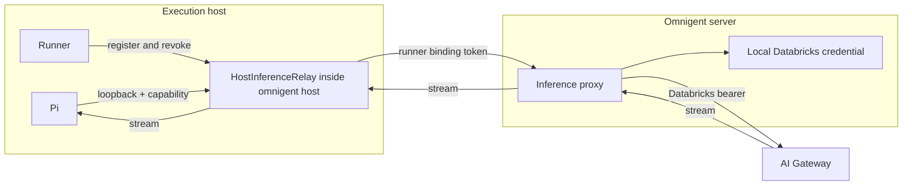

# Onih Server-Brokered Inference Design

## Status

Implementation in progress.

This document defines the single-user v1. Multitenancy is explicitly deferred
and must receive its own design before the server is shared across users.

## Summary

A server-backed Onih Pi session first uses a matching provider from a locally
usable ucode-generated Pi configuration. When local Pi cannot serve the selected
model, Pi sends the request through a loopback relay inside `omnigent host`. The
relay forwards it to the Omnigent server with the session's runner binding token.
The server validates the binding, refreshes its local Databricks credential,
calls AI Gateway, and streams the response back.

The Databricks bearer never leaves the server. An execution host needs Omnigent
and Pi, but does not need `.databrickscfg`, a Databricks login, ucode, or the
Databricks SDK.

Standalone execution without a server keeps using local provider resolution.

## Decisions

1. Server-backed local and SSH sessions share local-first, server-fallback routing.
2. The relay runs in the existing host process, not a new process.
3. The server proxies inference; it does not vend raw Databricks tokens.
4. The single-user server uses its local `.databrickscfg` and Databricks SDK.
5. V1 supports Anthropic Messages, OpenAI Responses, and OpenAI Chat Completions.
6. Databricks SDK authentication refreshes on demand. There is no background
   credential heartbeat in v1.
7. Only providers that `pi auth check` reports ready are eligible for local routing.
8. Built-in Onih targets do not pin a hidden default model.
9. Multitenancy, shared workers, and per-user credential storage are non-goals
   for v1.

## Goals

- A user logs into Databricks on the server machine, connects a fresh SSH host,
  waits for Pi installation, and can start Onih Pi without another login.
- Local and SSH Onih Pi sessions use identical model and credential behavior.
- No Databricks bearer is stored or exposed on the execution host.
- Runner replacement or session deletion revokes old proxy access.
- The proxy preserves streaming and cancellation.
- A missing or outdated Pi binary remains a host setup failure.
- Expired or revoked server OAuth becomes an actionable reauthentication error.

## Non-goals

- Multitenant server security.
- Shared-host tenant isolation.
- Generic workspace API proxying.
- Arbitrary upstream URLs.
- MLflow or Gemini inference surfaces.
- Remote Databricks or ucode setup.
- Background OAuth heartbeats.
- Replacing standalone provider resolution.

## Execution modes

| Mode | Credential path |
| --- | --- |
| Server-backed localhost session | Ready local Pi/ucode provider, then server inference proxy |
| Server-backed SSH session | Ready local Pi/ucode provider, then server inference proxy |
| Server-backed managed host | Ready local Pi/ucode provider, then server inference proxy |
| Direct runner without a host | Runner may embed the same relay adapter |
| Standalone/no-server | Local provider resolution |

Local routing is selected before a request only from Pi providers that declare
their own `models.json` credential and pass Pi's readiness check. A broker failure
does not replay an in-flight request through ambient host credentials.

## Architecture



No additional operating-system process is introduced.

## Host inference relay

`HostInferenceRelay` is an async component owned by `HostProcess`.

```python
class HostInferenceRelay:
    async def start(self) -> None: ...
    def register(self, session_id, runner_id, binding_token) -> RelayEndpoint: ...
    def revoke(self, runner_id) -> None: ...
    async def close(self) -> None: ...
```

The relay:

1. Binds one ephemeral loopback port.
2. Generates a 256-bit random capability per runner generation.
3. Stores the capability hash, session ID, runner ID, and runner binding token
   in memory.
4. Accepts only the three fixed Pi gateway path prefixes.
5. Removes client authorization and forwards the request through the host's
   existing server transport.
6. Revokes the capability when the runner stops or exits.
7. Clears all state when the host exits.

The capability is not a Databricks credential. It authorizes only inference for
the bound session while that runner generation remains active.

## Host protocol

`HostHelloFrame` advertises:

```json
{"inference_proxy": true}
```

`HostLaunchRunnerFrame` selects broker mode:

```json
{
  "kind": "host.launch_runner",
  "session_id": "conv_123",
  "binding_token": "<runner binding token>",
  "harness": "pi",
  "inference_proxy": true
}
```

The server sets `inference_proxy` only when:

- the session harness is Pi,
- the host advertised support, and
- the server has a Databricks provider selected for Pi.

An old host fails with its existing setup behavior. It is never told to use a
protocol it did not advertise.

## Host launch readiness

Raw host readiness can report:

```json
{"pi": "needs-auth"}
```

Broker mode covers only that auth requirement. It does not cover:

- `binary-missing`,
- `version-too-low`, or
- runner launch failures.

The effective v1 result is a ready value plus a reason when blocked:

```text
pi_ready = binary_ready AND server_provider_configured AND host_proxy_supported
```

The existing API may continue returning `configured_harnesses.pi = true` for
compatibility when the broker covers a raw `needs-auth` result. Internally the
raw host report remains unchanged.

## Runner and Pi configuration

For a brokered launch, the host injects into the runner:

```text
OMNIGENT_INFERENCE_PROXY_URL=http://127.0.0.1:<port>/v1/inference
OMNIGENT_INFERENCE_PROXY_TOKEN=proxy_<random>
```

The runner's Pi spawn configuration translates this to:

```text
HARNESS_PI_SERVER_PROXY=true
HARNESS_PI_GATEWAY=true
HARNESS_PI_GATEWAY_HOST=<relay URL>
HARNESS_PI_GATEWAY_BASE_URLS=<relay Anthropic and Responses URLs>
PI_OMNIGENT_INFERENCE_PROXY_TOKEN=<capability>
```

Pi's generated `models.json` references the environment-backed capability. It
does not contain a Databricks bearer.

The v1 wire choice is deliberately small:

```text
Claude model            -> Anthropic Messages
Responses-capable model -> OpenAI Responses
other endpoint alias    -> OpenAI Chat Completions
```

Models requiring the unsupported MLflow or Gemini surfaces fail before Pi
launch rather than being sent to a guessed endpoint.

The server still validates the surface and upstream path. Adding another
surface requires an explicit code and test change.

## Server inference API

Proposed internal route:

```text
POST /v1/runners/{runner_id}/sessions/{session_id}/inference/{surface}/{path}
```

The route requires the runner binding token and validates:

1. `token_bound_runner_id(token) == runner_id`.
2. The session exists.
3. The session's current `runner_id` matches.
4. The session is host-bound.
5. The surface and path are one of the fixed v1 mappings.

An owner JWT by itself is insufficient.

### V1 surfaces

| Surface | Exact upstream path |
| --- | --- |
| `anthropic` | `/ai-gateway/anthropic/v1/messages` |
| `responses` | `/ai-gateway/openai/v1/responses` |
| `completions` | `/serving-endpoints/chat/completions` |

The runner cannot provide an upstream host or arbitrary URL. The workspace host
comes from the server's configured Databricks provider.

### Request handling

The proxy:

- rejects unsupported paths,
- enforces request size limits,
- strips client `Authorization`, cookies, host, and hop-by-hop headers,
- gets a current bearer from the server's Databricks SDK,
- injects the server bearer,
- disables upstream redirects,
- buffers a bounded request body and streams the upstream response,
- strips unsafe response headers, and
- closes the upstream stream when the client disconnects.

## Server credential lifecycle

The v1 server resolves its selected Pi provider from
`~/.omnigent/config.yaml`. The provider points to a profile in the server's
`~/.databrickscfg`.

The server caches the SDK auth object by `(credential_ref, workspace_host)` and
calls `authenticate()`/`current_token()` on demand. The SDK reuses or refreshes
its access token as needed.

At broker readiness or first launch, the server should perform one authentication
check. Failure produces:

```text
server_reauth_required
```

There is no background health monitor in v1. A future monitor must not attempt
to defeat grant revocation, SSO policy, or absolute token lifetime.

A server restart loses only the in-memory SDK object. If the Databricks CLI's
persisted OAuth grant is still renewable, the SDK recreates the access token
without another browser login.

## Security boundaries

### Databricks bearer

The bearer:

- is minted/refreshed only on the server,
- is used only in the server-to-gateway request,
- never crosses SSH,
- never reaches the host, runner, or Pi,
- never appears in `models.json`, process arguments, or runner environment, and
- must be redacted from logs and telemetry.

### Local proxy capability

The local capability:

- is random and scoped to one runner generation,
- is accepted only on loopback,
- is stored by hash in host memory,
- grants inference only through the server's fixed proxy,
- cannot call arbitrary workspace APIs, and
- is revoked on runner stop, exit, or replacement.

### SSRF prevention

- No request field selects an upstream host or URL.
- The server owns the workspace host.
- Surface-to-path routing is a closed map.
- Redirect following is disabled.
- Client authorization and proxy headers are removed.

## Streaming and cancellation

The response path is streaming; v1 buffers a bounded JSON request body:

```text
Pi <-> host relay <-> server proxy <-> AI Gateway
```

V1 must:

- preserve byte and event ordering,
- avoid buffering complete responses,
- buffer only request bodies within the configured bound,
- bound request bodies and headers,
- propagate disconnect/cancellation upstream,
- close upstream clients promptly, and
- avoid replaying a partially delivered request.

## Failure behavior

| Failure | Result |
| --- | --- |
| Pi missing | `binary_missing` |
| Pi too old | `version_too_low` |
| Server has no Pi provider | `server_no_provider` |
| Server OAuth invalid | `server_reauth_required` |
| Host lacks proxy support | `host_protocol_unsupported` |
| Capability invalid | 401 |
| Runner replaced | old binding receives 401 |
| Session deleted | 404/410 |
| Model/surface mismatch | rejected before upstream call |
| Gateway unavailable | sanitized upstream failure |
| Server restart | SDK auth object is rebuilt |
| Host restart | relay state is lost and runners relaunch |

## Observability

V1 emits only:

```text
inference.proxy.request.started
inference.proxy.request.completed
inference.proxy.request.failed
```

Fields:

```text
session_id
runner_id
model
surface
status
latency_ms
```

Do not record request/response bodies, prompts, authorization headers, OAuth
payloads, Databricks bearers, or proxy capabilities.

## Implementation phases

### Phase 1: Vertical slice

- Server runner-bound proxy with three surfaces.
- In-process host relay.
- Host capability and launch-frame fields.
- Pi proxy spawn environment.
- Effective readiness for broker-covered `needs-auth`.

### Phase 2: Correctness and hardening

- Stream cancellation and size bounds.
- Runner stop/replacement revocation.
- Server and host restart behavior.
- Bearer/log/filesystem leak checks.
- Actionable `server_reauth_required` errors.

### Phase 3: Local/direct adapter

- Use the same relay contract for server-backed runners without a host daemon.
- Preserve standalone/no-server direct provider resolution.

Rate limits, detailed usage attribution, extra protocol surfaces, shared workers,
and multitenant credentials are post-v1 work.

## Required tests

### Unit

- Host and launch frame round trips preserve proxy capability flags.
- Broker mode covers `needs-auth`, not missing/outdated Pi.
- Relay capability registration and revocation are idempotent.
- Invalid local capability is rejected.
- Binding token must match runner ID.
- Session must still be bound to that runner.
- Unsupported surfaces and paths are rejected.
- Client authorization is stripped and server authorization is injected.
- Pi spawn environment uses the relay and does not resolve a remote provider.
- Built-in Onih targets have no hidden model pin.

### Integration

- Fresh SSH home has no Databricks or ucode state.
- SSH manager installs Pi using the configured npm registry.
- Onih Pi completes a streamed turn through relay and server proxy.
- Local ucode-configured Pi is preferred, with a model miss routed through the proxy.
- Runner replacement invalidates the old capability.
- Session deletion revokes access.
- Server restart reconstructs SDK auth from its local login.
- Invalid server OAuth returns `server_reauth_required`.

### Security

- Search remote files, process arguments, logs, artifacts, and conversation rows
  for the Databricks bearer; expect no matches.
- Attempt SSRF through path, host, redirect, query, and header manipulation.
- Attempt cross-session and stale-runner binding reuse.

## Compatibility

- Broker fields default to false, so older messages decode normally.
- The server enables broker mode only after the host advertises support.
- Local standalone Pi retains its current provider path.
- Non-Onih Pi agents retain their current behavior unless explicitly launched in
  broker mode.
- Only ready, self-contained local Pi providers are copied into Onih's isolated config.

## Deferred multitenancy

V1 assumes one server user and one principal per host. Before enabling a shared
server or shared worker, design and implement:

- per-user encrypted credential storage,
- credential/model cache isolation,
- tenant-aware authorization and usage attribution, and
- a relay placed inside the tenant isolation boundary.

These requirements do not add fields or abstractions to the single-user v1.

## Acceptance criteria

1. The user authenticates Databricks only on the server machine.
2. A fresh SSH host has no Databricks or ucode credential state.
3. The host becomes effectively Pi-ready after managed Pi installation.
4. Local and SSH server-backed sessions use the same proxy contract.
5. A real Onih Pi turn streams successfully through the proxy.
6. The Databricks bearer is absent from the execution host and durable state.
7. OAuth refresh works while the server grant remains renewable.
8. Revocation produces an actionable reauthentication error.
9. Runner replacement and session deletion invalidate stale access.
