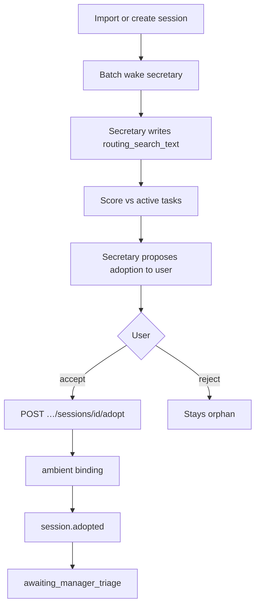

# Orphan session adoption (Phase 5.5)

**Goal:** Offer to route imported and user-started sessions into the task system.
**Orphan sessions are allowed** — a session stays unbound until the user accepts
a secretary adoption proposal. Reject → no manager involvement.

**Migration:** Deferred. Reuse existing event states and conversation labels.

## Design decisions (locked)

| Topic | Decision |
|-------|----------|
| Orphan default | Sessions stay orphan until user **accepts** adoption |
| Auto-adopt | **Never** for sessions — always secretary propose → user accept |
| Routing text | Secretary writes `omnigent.task.routing_search_text` before scoring |
| User reject | No binding; optional `omnigent.task.adoption_dismissed=1` label |
| Host imports | `host_id` → `host.owner` → that user's secretary |
| User sessions | Same pipeline as poller import |
| Secretary wake | **Batch/debounced** for poller bursts |
| No secretary session | Queue pending; process when secretary session starts |
| After accept | `POST …/sessions/{id}/adopt` → `ambient` bind + `session.adopted` → manager triage |

## Pipeline overview

1. **Detect** orphan (no binding; not task-spawned `manager`/`worker`).
2. **Batch-wake secretary** for the session owner (`host.owner` or session user).
3. **Secretary writes routing search text** (see [TASK_SECRETARY.md](TASK_SECRETARY.md)).
4. **Score** tasks using that text (thresholds inform the proposal, not auto-adopt).
5. **Secretary proposes** which task should adopt the session (top match + alternatives).
6. **User accepts** → `POST /v1/agent-tasks/sessions/{session_id}/adopt`.
7. **User rejects** → session remains orphan; set dismiss label to avoid re-prompting.

Scoring thresholds (≥ `0.6`, margin ≥ `0.15`) rank candidates for the proposal;
they do **not** auto-bind sessions.

## Routing search text storage

| Label key | Purpose |
|-----------|---------|
| `omnigent.task.routing_search_text` | Keyword-dense text for task scoring |
| `omnigent.task.routing_repo` | Optional repo hint |
| `omnigent.task.routing_intent` | Optional one-line intent |
| `omnigent.task.adoption_dismissed` | Set when user rejects adoption (`1`) |

## Event type

`session.adopted` — created only after user accepts. Links via `source_session_id`.
Lands in `awaiting_manager_triage` for manager review.

## Hooks

| Hook | When |
|------|------|
| `POST /v1/imports` success | Poller path; owner = `host.owner` |
| `POST /v1/sessions` create | User-started Omnigent sessions |
| `POST /v1/agent-tasks/secretary/session` | Flush queued orphan sessions |

Excluded: task-spawned sessions (`bootstrap`, `dispatch`).

## API

| Method | Path | Purpose |
|--------|------|---------|
| POST | `/v1/agent-tasks/sessions/{session_id}/propose-adoption` | Secretary scores tasks and creates proposal |
| POST | `/v1/agent-tasks/sessions/{session_id}/adopt` | User accepted; bind + wake manager |
| POST | `/v1/agent-tasks/sessions/{session_id}/reject-adoption` | User rejected; stay orphan |

Secretary may also use resolve-style flows on a `session.adoption` proposal event
if we model proposals as task events (implementation choice).

## After adoption

Events with `source_session_id` use the Phase 5 distributor binding fast-path.
