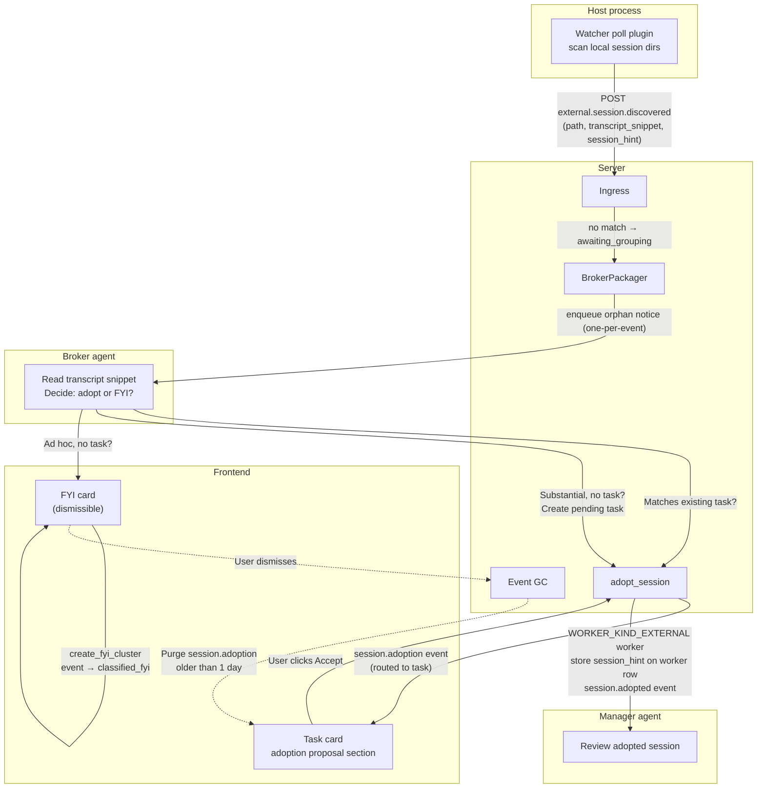
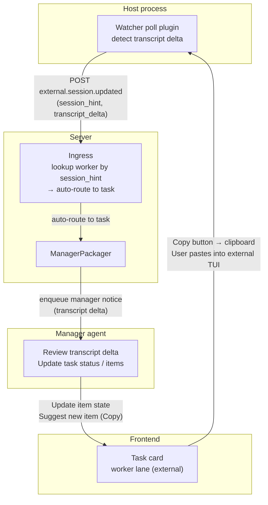
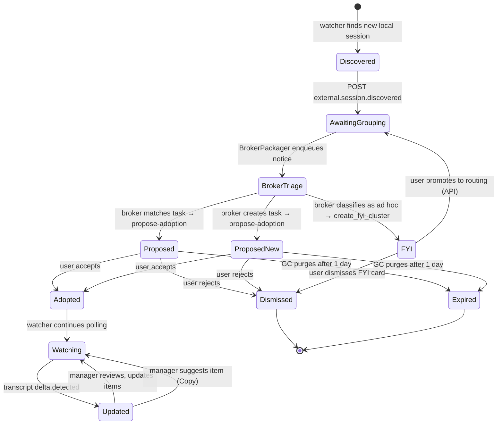

# Session Watcher

A read-only external session monitor. The watcher discovers local sessions
from other harnesses (Codex, Cursor, etc.), reports them to the server as
events, and the broker triages them into task-level adoption proposals. Once
adopted, the watcher continues to poll for transcript updates and emits
events so the manager can track progress. The manager can suggest work items
to external sessions, but since we can't write to them, the frontend shows a
**Copy** button instead of **Go**.

## Scope

- **In scope:** local session discovery, adoption flow, transcript-update
  watching, manager "Copy" suggestions.
- **Out of scope (for now):** writing to external sessions, SSH remote
  session discovery (SSH remotes run their own host process with its own
  watcher — the local watcher only covers sessions on this machine).

## Why

External TUI sessions (Codex, Cursor) run independently of Omnigent. Users
often start work in them without going through Omnigent's task system. The
watcher bridges this gap: it discovers those sessions, lets the broker
propose adopting them under a task, and then keeps the manager informed as
the external session's transcript advances — all without steering the
external session.

## Architecture

### Discovery & adoption



### Transcript update watching



### Full lifecycle



## Component 1 — Watcher poll plugin (host-side)

A **script poll plugin** under `~/.omnigent/poll_plugins/session_watcher/`
that the user authors. The infrastructure (`ScriptPollPluginsPoller`) already
exists — the watcher is just a `run.py` + `config.yaml` + `state.yaml`.

### Responsibilities

1. **Discover** local external sessions by scanning well-known directories
   (e.g. `~/.codex/sessions/`, Cursor project dirs). The discovery logic is
   plugin-private — the author decides what to scan.
2. **Track** seen sessions and last-seen transcript byte offset in
   `state.yaml`.
3. **New session** → POST `external.session.discovered` to
   `/v1/task-events` with `X-Omnigent-Host-Id` header.
4. **Known session with transcript delta** → POST
   `external.session.updated` with the new transcript snippet and a stable
   session hint.

### Why a poll plugin (not built-in)

The ambient polling stack was removed intentionally — external TUIs load
transcripts once at startup and can't be steered, so the machinery wasn't
worth it. The poll plugin approach lets the user control what to scan and
how often, without baking discovery logic into the server.

### Event payloads

The watcher includes a **recent transcript snippet** in the payload so the
broker (server-side) doesn't need filesystem/SSH access to read the external
session.

**`external.session.discovered`:**

```json
{
  "session_hint": "<stable id, e.g. hash of path or external tool session id>",
  "path": "/Users/me/.codex/sessions/abc123",
  "tool": "codex",
  "transcript_snippet": "<last N lines of transcript>",
  "metadata": { "any plugin-private fields": true }
}
```

**`external.session.updated`:**

```json
{
  "session_hint": "<same stable id>",
  "transcript_delta": "<new lines since last poll>",
  "new_byte_offset": 4096
}
```

### Config (`config.yaml`)

```yaml
# Plugin-private. The host poller infra provides interval_s at the host level.
scan_dirs:
  - ~/.codex/sessions
  - ~/.cursor/projects
snippet_lines: 50
```

## Component 2 — Event types & ingress

### New event types (`event_types.py`)

| Constant | Value | Lane |
|----------|-------|------|
| `EXTERNAL_SESSION_DISCOVERED` | `external.session.discovered` | Broker orphan |
| `EXTERNAL_SESSION_UPDATED` | `external.session.updated` | Manager (auto-routed) |

Neither starts with `session.` so both pass through `POST /v1/task-events`
(the `is_session_internal_event` guard only blocks `session.*`).

### Ingress routing

**`external.session.discovered`:**
- No `task_id`, no `source_internal_session_id` → stalls to
  `awaiting_grouping`.
- BrokerPackager picks it up, treats it like an orphan (one-per-notice).

**`external.session.updated`:**
- Carries `source_internal_session_id` = the adopted session's conversation
  ID (the server stores the `session_hint` → conversation ID mapping at
  adoption time — see Component 4).
- Ingress auto-routes to the task bound to that conversation.
- ManagerPackager picks it up, manager reviews the transcript delta.

## Component 3 — Broker orphan handling

The `BrokerPackager` already has an orphan path for `session.orphan` events.
We extend it to also treat `external.session.discovered` as an orphan-style
event (one-per-notice, no clustering).

### Broker flow for discovered sessions

1. BrokerPackager scans `awaiting_grouping` events, finds
   `external.session.discovered`.
2. Enqueues a single-event notice to the broker queue.
3. Broker agent receives the notice, reads the `transcript_snippet` from the
   payload, summarizes and understands what the session is about.
4. Broker decides one of three outcomes:

   | Outcome | When | Action |
   |---------|------|--------|
   | **Adopt to existing task** | Session matches an active task | Write routing tags, call `propose-adoption` with the matched task ID |
   | **Adopt to new task** | Session is substantial work but no matching task | Create a new pending task, call `propose-adoption` against it |
   | **FYI cluster** | Session is ad hoc work, not related to any task and not worth creating a task | Call `POST /v1/task-events/fyi-clusters` to classify as FYI |

   The FYI path reuses the existing `create_fyi_cluster` flow: the event
   becomes `classified_fyi`, a dismissible FYI card appears on the board,
   and the user can dismiss it or (via API) promote it back to routing later
   if circumstances change.

### `propose-adoption` for external sessions

The existing `propose_session_adoption` in `adoption.py` already:
- Scores tasks by routing tags
- Creates a `session.adoption` proposal event

We extend it to:
- Accept a `session_hint` parameter (stored on the proposal event payload)
- If no matching task is found, the broker creates a new pending task first,
  then proposes adoption against it

## Component 4 — Task-level adoption card

**Key design decision:** the card is always task-level. An adopted session
is a **worker** assigned to a task — it is not a separate "adoption card"
entity. If no existing task matches, the broker creates a new task.

### How it works

1. Broker proposes adoption → creates a `session.adoption` event with
   `task_id` set (existing or newly created task).
2. The event is routed to the task (state `routed`).
3. The frontend renders the task card as usual (one card per task).
4. The task card shows an **adoption proposal section** — a row for each
   pending `session.adoption` event on this task, with Accept/Reject buttons.
5. Multiple sessions can be proposed for the same task → multiple rows in
   the adoption section of the same card.
6. Each row is individually dismissible (Reject) or acceptable (Accept).

### Adoption proposal section on the task card

```
┌─ Task: "Fix login flow" ────────────────────────────────┐
│                                                          │
│  Items:                                                  │
│    [ ] Run auth tests             (pending)              │
│    [x] Fix credential refresh     (done)                 │
│                                                          │
│  Pending adoption proposals:                             │
│    Codex session ~/.codex/sessions/abc  [Accept] [Reject]│
│    Cursor session ~/.cursor/projects/xy  [Accept] [Reject]│
│                                                          │
│  Workers:                                                │
│    [managed]  worker-1  running "Run auth tests"         │
│    [external] session-abc  (adopted)  idle               │
│                                                          │
└──────────────────────────────────────────────────────────┘
```

### Accept flow

1. User clicks Accept → `POST /v1/agent-tasks/sessions/{id}/adopt`.
2. `adopt_session` creates a `WORKER_KIND_EXTERNAL` worker bound to the task.
3. Stores `session_hint` → conversation ID mapping (as a conversation label
   or a new column on the worker row) so future `external.session.updated`
   events can auto-route.
4. Emits `session.adopted` event, routed to the manager.
5. Manager triages the adopted session like any other worker.

### Reject flow

1. User clicks Reject → `POST /v1/agent-tasks/sessions/{id}/reject-adoption`.
2. Sets `omnigent.task.adoption_dismissed=1` label on the conversation.
3. The `session.adoption` event becomes `dismissed`.

### 1-day timeout

Adoption proposals that are not accepted or rejected within 1 day are
auto-purged. This reuses the event GC (`purge_old_events`) we just built:

- Add a new GC category: `session.adoption` events in state `routed` (proposed
  but pending) older than 1 day → purged.
- Once accepted, the event becomes `reconciled` and follows the normal 3-week
  retention.

### Session hint lookup

When `external.session.updated` arrives, ingress needs to find the task. The
`session_hint` in the event payload is matched against the stored mapping:

- **Option A:** Store `session_hint` as a conversation label
  (`omnigent.session.external_hint`). Lookup: `conversation_store` query by
  label → worker → task.
- **Option B:** Store `session_hint` as a column on the worker row. Lookup:
  `worker_store.get_by_external_hint(hint)` → task.

**Recommendation:** Option B (worker column) — it's a direct lookup, no
label parsing, and the worker is the entity that binds the session to the
task. This requires:
- A new `external_session_hint` column on the `workers` table (migration).
- `worker_store.get_by_external_hint(hint) -> Worker | None`.
- In `ingress.py`, before stalling, check if the event is
  `external.session.updated` and look up the worker by hint → route to task.

## Component 5 — Transcript update watching

Once a session is adopted, the watcher keeps polling it. When the transcript
grows:

1. Watcher POSTs `external.session.updated` with `session_hint` and
   `transcript_delta`.
2. Ingress looks up the worker by `session_hint` → finds the task →
   auto-routes the event.
3. ManagerPackager enqueues a manager notice with the transcript delta.
4. Manager reviews the delta, updates task status, and may:
   - Update the item state (e.g. mark an item as done if the transcript
     shows the work was completed).
   - Suggest a new task item for the user to copy into the external session.

The manager does **not** write to the external session. The item state
transitions are inferred from the transcript content (the manager agent
reads the delta and decides).

## Component 6 — Manager "Copy" suggestions

When the manager creates a task item assigned to an external worker:

1. `TaskItem.worker_id` points to the `WORKER_KIND_EXTERNAL` worker.
2. The frontend detects `worker.kind == "external"` and shows a **Copy**
   button instead of **Go**.
3. Copy copies the item's `instructions` to the clipboard.
4. The user pastes the instructions into the external session's TUI manually.
5. The item state stays `pending` until the watcher detects transcript
   activity, at which point the manager infers the item is running.

### Frontend changes

- `TaskCardWorkerRows`: detect `worker.kind == "external"`, render a Copy
  button instead of the Go/activate button.
- The Copy button uses `navigator.clipboard.writeText(item.instructions)`.
- No dispatch, no `activate_worker_lane`, no session creation for external
  workers.

## Component 7 — Adoption timeout GC

Extend `event_gc.py` with a new purge category:

```python
n_proposals = task_event_store.purge_old_events(
    before_ts=now - int(config.adoption_proposal_retention_s),
    states=["routed"],
    event_type="session.adoption",  # new filter
)
```

This requires `purge_old_events` to accept an optional `event_type` filter
(the `list_events` method already has one — we add the same to the purge
method).

### Config

```yaml
server:
  event_gc:
    interval_s: 3600
    reconciled_retention_s: 1814400     # 3 weeks
    stale_routed_retention_s: 604800    # 7 days
    queue_retention_s: 1814400          # 3 weeks
    adoption_proposal_retention_s: 86400  # 1 day
```

## Implementation plan

### Phase 1: Event types & ingress

- [ ] Add `EXTERNAL_SESSION_DISCOVERED` and `EXTERNAL_SESSION_UPDATED` to
  `event_types.py`.
- [ ] Add `event_type` filter to `purge_old_events` in `TaskEventStore` ABC
  + SQLAlchemy impl.
- [ ] Add `external_session_hint` column to `workers` table (migration).
- [ ] Add `worker_store.get_by_external_hint(hint)`.
- [ ] In `ingress.py`, add a pre-stall check for
  `external.session.updated`: look up worker by hint → route to task.

### Phase 2: Broker orphan handling

- [ ] Extend `BrokerPackager` to treat `external.session.discovered` as
  orphan-style (one-per-notice).
- [ ] Extend `propose_session_adoption` to accept `session_hint` and store it
  on the proposal event payload.
- [ ] Allow broker to create a new pending task when no match is found, then
  propose adoption against it.
- [ ] Broker agent instructions: for `external.session.discovered`, decide
  among adopt-to-existing-task, adopt-to-new-task, or FYI cluster. Use
  existing `create_fyi_cluster` for the FYI path.
- [ ] Broker prompt: include the FYI option in the orphan notice text so the
  broker agent knows it can classify as FYI instead of forcing adoption.

### Phase 3: Adoption flow

- [ ] Extend `adopt_session` to store `session_hint` on the worker row
  (`external_session_hint` column).
- [ ] Emit `session.adopted` event routed to manager (already exists).
- [ ] Frontend: render pending `session.adoption` events as rows in the
  adoption proposal section of the task card.
- [ ] Frontend: per-row Accept/Reject buttons.

### Phase 4: Transcript update watching

- [ ] ManagerPackager: handle `external.session.updated` events (they arrive
  routed to the task, so existing flow mostly works).
- [ ] Manager notice format for transcript deltas (structured prompt with the
  delta content).
- [ ] Manager agent instructions: review delta, update task/items.

### Phase 5: Copy button

- [ ] Frontend: detect `worker.kind == "external"`, show Copy instead of Go.
- [ ] Copy handler: `navigator.clipboard.writeText(item.instructions)`.

### Phase 6: Adoption timeout GC

- [ ] Add `adoption_proposal_retention_s` to `EventGcConfig` (default 86400).
- [ ] Add purge call for `session.adoption` events in `routed` state older
  than the retention.
- [ ] Wire in `run_event_gc`.

### Phase 7: Example watcher plugin & docs

- [ ] `examples/poll_plugins/session_watcher/run.py` — example discovery +
  transcript delta detection.
- [ ] `examples/poll_plugins/session_watcher/config.yaml`.
- [ ] `docs/agent-tasks/SESSION_WATCHER.md` — this doc, finalized.

## Open questions

1. **Transcript snippet size:** How many lines should the watcher include in
   the `transcript_snippet`? Too few and the broker can't understand the
   session; too many and the event payload is huge. Default: 50 lines,
   configurable in the plugin's `config.yaml`.

2. **Multiple sessions per task:** Can a task have multiple adopted external
   workers? Yes — each is a separate `WORKER_KIND_EXTERNAL` worker row. The
   task card shows each as a worker lane with a Copy button.

3. **Re-discovery after dismissal:** If the user rejects an adoption proposal
   or dismisses an FYI cluster, but the watcher keeps polling, will it
   re-emit `external.session.discovered` for the same session? The watcher's
   `state.yaml` should track dismissed sessions and skip them. Alternatively,
   the server can dedupe by `session_hint` + `adoption_dismissed` label or
   `classified_fyi` / `dismissed` event state.

4. **External worker item states:** When the manager assigns an item to an
   external worker and the user copies instructions, the item starts as
   `pending`. The watcher's transcript delta lets the manager infer progress.
   Should the manager auto-transition `pending → running` when it detects
   transcript activity, or should the user manually mark it? Recommendation:
   manager auto-transitions based on transcript content.
