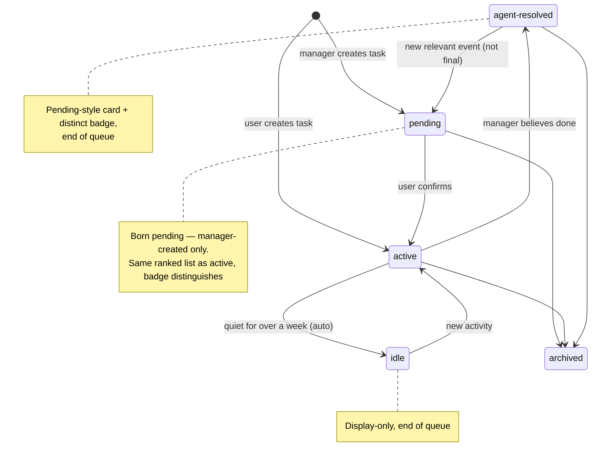

# PuppyGarden v2: Manager-Centric Architecture

**Status:** Draft for review **Scope:** Refactor PuppyGarden from per-task managers (manager:task = 1:1) to a manager-centric model (manager:task = 1:N), narrow the broker to a fallback router, and delete the adoption pipeline.

---

## 1. Context and motivation

Today PuppyGarden binds one manager session per task (`tasks.manager_conversation_id`, spawned fresh per task) and one worker lane per task. Three observations motivate the change:

1. **Users work in drifting sessions.** A user reuses one session for task A, then task B, then task C — rarely returning. At any moment a session is doing one thing, so per-event routing should follow the session's *current* attention; durable session bindings are unnecessary except for explicit monitoring.
2. **Users do not start work inside PuppyGarden.** Work starts in plain sessions or external sources (Slack, GitHub). The system's job is purely digestive: observe everything, reconcile into tasks, recent activity, and next action items.
3. **Most events already know where to go.** Worker bindings and event subscriptions are persisted routing data: a session event belongs to the tasks its session is bound to; a source event belongs to the tasks that subscribe to that source. The common delivery path is deterministic and direct — search and the broker exist for the remainder.

**What stays:** the TaskItem → worker lane → execution pipeline (items assigned to workers, executions tracked, `worker.execution.finished` events) is unchanged and remains the execution backbone.
Naming: the current per-task system is **v1**; this doc proposes **v2**.
The redesign goal: an immersive working environment where **deterministic code produces candidates and context, and LLM agents make judgment calls** — replacing score-threshold auto-routing with search-and-decide.

## 2. Design principles

* **Manager-centric**: a manager is a long-lived generalist owning a portfolio of tasks. All task-shaped work (create, reconcile, steer, summarize) belongs to managers.
* **Persisted data routes first**: worker bindings and subscriptions deterministically route events straight to the relevant managers — no broker involvement.
* **Broker is the fallback router**: only events with no persisted route and no confident scorer match reach the broker. It clusters similar events and distributes them to the correct manager — or spins up a new manager when scope, capacity, or host compatibility demands. It never creates or manages tasks/items.
* **Routing follows attention**: session events are routed per-event (persisted bindings first, then recent activity + text relevance), not via durable session history.
* **Opt-in tracking**: a task tracks an external source only when a manager or user explicitly subscribes. No system-initiated adoption, so no negative filtering (tombstones) is needed.
* **Cheap v2, tunable later**: capacity caps and relevance thresholds ship as config constants with permissive defaults; attach decisions and scores are logged from day one so thresholds can be tuned from data.

## 3. Target architecture

| Component | v2 duty | Removed |
| :---- | :---- | :---- |
| Ingress / scorer | Emit events; tag-similarity scoring of **external** events routes them to the best-matching manager when confident. Session events skip the scorer — unbound ones surface directly to the broker | Auto-adopt thresholds |
| Persisted routing (worker bindings + subscriptions) | Deterministic direct delivery: session events → the session's worker binding(s) → those tasks' manager(s) (can be multiple); source events → the managers of subscribed tasks | Broker as middleman for known routes |
| Broker | Fallback router for events with no programmatic route — all unbound session events, and external events the scorer can't place: cluster similar events → distribute to the correct manager; spin up a new manager on scope/capacity; FYI the unplaceable | Task/item creation, pending-task management, orphan triage |
| Manager (1:N) | Everything task-shaped: digest events, pick the task (three-list search), create tasks/items, steer, maintain Overview, ack noise, file events to FYI; task lifecycle: mark agent-resolved (end of queue), revive to pending on new events; idle is automatic after a quiet week | — |
| Worker | A shareable lane: **one worker = one lane = one queue**. All items assigned to the same worker share its lane — across tasks too. Tasks keep references to their worker lanes; managers propose items with a target lane and the user acks dispatch. The Worker row is only the binding — it does not own the session. Lane status (e.g. halted) broadcasts to every referencing task, and recovery broadcasts too (user resends/rewinds a message and the session works again → unblock all queues) | Auto-adoption |
| Agent queue | One queue per manager session; one queue per worker | Per-task manager queues |
| Task search | Three lists — recent (≤3, no state filter), text matches (≤20), tag matches (≤20) — the manager's tool for selecting among its tasks | — |

### 3.1 Routing precedence

By event kind, first rule that applies:
**Session events** (turn finished, external session updates):

1. **Bound session** → tasks attached via the session's worker row(s) → route to all those tasks' managers (can be multiple — each manager receives the event labeled with its own task). Direct — no broker.
2. **Unbound session** → directly to the broker. The scorer is not consulted for session events.

**External / source events** (poll plugins, Slack, GitHub, …):

1. **Subscription match** on `(source, source_key)` → deliver to the managers of the subscribed tasks. Direct — no broker.
2. **No subscription** → tag-similarity scorer: confident match → the matched task's manager; otherwise → broker.

**Broker** (rules 2 and 4-else): cluster similar events (host-aware — never mix hosts) → split into subclusters when useful → distribute each to the correct manager → or spin up a new manager (scope, capacity, or host compatibility) → FYI the unplaceable.
**Manager** receives the event → selects among its tasks using the three-list search (recent ≤3, text matches, tag matches; for bound-session events, the attached tasks ranked by recency) → reconciles (extend/split/resolve items, update Overview, ack) → or creates a new task, born **pending**.

### 3.2 Walkthrough: session drift

1. User works on task A in session S → `session.turn.finished(S)` → ingress.
2. S is unbound → surfaces **directly to the broker** → broker distributes to M (the owner's manager).
3. M reconciles into task A — extend/split/resolve items, update Overview, ack — and may attach S to A so later turns route directly (rule 1). If A goes quiet for over a week, it turns idle automatically (display-only, end of queue).
4. User pivots to new work B in the **same** session → next `turn.finished(S)` → via S's binding (rule 1) or via the broker if still unbound → M.
5. M's three-list search shows nothing fits → **M creates task B, born pending**; the user confirms → B activates, attached to M.
6. When A/B looks done, M marks it **agent-resolved** — same board card style as pending with a distinct badge, sorted to the end of the queue. Not final: a new relevant event moves it back to pending.

A wrong route costs one manager ack (or a re-route, PR 10).

### 3.3 Subscriptions and monitoring — a common path

Subscriptions are a first-class, common delivery path, not an edge case: poll watchers on PRs / Slack threads / docs, and explicitly attached sessions. A manager (or user) subscribes a task to `(source, source_key)` (`POST /v1/agent-tasks/<id>/event-subscriptions`, exists today); matching events are delivered to the managers of the subscribed tasks. There is no fan-out: delivery targets are managers — several subscribed tasks sharing one manager produce one delivery to that manager, labeled per task.

### 3.4 Worker lanes and halt broadcast

A worker is a single long-lived lane (one target session, one queue); the Worker row is just the task↔lane binding — it does not own the session. Tasks hold references to the lanes they may use; a manager proposing work picks a lane referenced by the task — shared lanes included — and assigns it on the item; **the user acks on the card; only then does the queue dispatch to that lane**. Because a lane may serve many tasks, its health is shared state: when the lane halts (dispatch retries exhausted → `disconnected`, initialization failed, **or the user stopping the session**), the single shared Worker row carries the state, so **every task referencing the lane sees it** — the worker picker shows ⚠ halted on each card until it recovers. Recovery is symmetric: when the user sends (or rewinds and resends) a message and the session works again, the lane un-halts (`recover_halted_queue_for_session` fires on idle — one lane = one queue, nothing to fan out) and the badge clears.

### 3.5 Task lifecycle states

All transitions except auto-idle are manager-initiated via `PATCH /v1/agent-tasks/<id>` (existing endpoint). `agent-resolved` is a new enum value — schema migration in PR 5, badge rendering in PR 11, manager guidance in PR 6.

## 4. Work plan

### Phase 1 — Queue re-key + search foundation

**PR 1: Manager queue re-key** (M)
Today the manager queue key is `manager/<user>/<task_id>` (`packagers.py:490`), so sharing a manager session across N tasks would make queue:session N:1 and break in-flight accounting (`complete_inflight_for_session` and `recover_halted_queue_for_session` both `.limit(1)`). Re-keying to the manager identity makes queue:session 1:1 again — all queue invariants hold by construction.

* `ManagerPackager._collect_pending`: group routed events by `(owner, task.manager_conversation_id)`; batch-fetch distinct tasks; events whose task has no manager stay `routed` (unchanged).
* Key: `AgentQueueKey(role=manager, owner, scope_id=manager_conversation_id)`.
* `_is_idle` / `_flush`: `status_for(scope_id)` directly (task lookup deleted).
* `ManagerDispatchHandler.resolve_target`: scope\_id *is* the conversation — validate directly (task fetch deleted).
* `completion.py` direct-enqueue of `worker.execution.finished`: `scope_id=task.manager_conversation_id`.
* `_format_manager_notice`: prefix each event with `[task:<id>] <title>`; header lists distinct tasks in the batch.
* Worker queues are already one-per-worker (`worker/<user>/<worker_id>`) — unchanged, affirmed as the target shape: **one queue per manager session, one queue per worker**.
* **Migration sweep** (one-time deploy script): cancel open manager-role queue items → source events fall out of `list_claimed_source_ids` → flip events back to `routed` → packager re-packages under new keys. Safe: events are durable, queue items are derived claims. Clean one-shot migration — no fallback/compat code; the DB currently holds only dummy/test data.
* Tests: `test_manager_packager.py`, `test_manager_handler.py`, sweep test (no event lost/duplicated).

**PR 2: Task search endpoint** (M)

* `GET /v1/agent-tasks/search?q=<text>&limit=<n>` → **three lists**: `{recent: [≤3], matches: [...≤20], tag_matches: [...≤20]}`.
* `recent`: most recently updated tasks, `ORDER BY updated_at DESC LIMIT 3` — **no state filter** — served by the existing `ix_tasks_state_updated` index (`db_models.py:2161`). For session-scoped queries, restricted to tasks attached to that session's worker, ranked by recency.
* `matches`: new fuzzy scorer in `scoring.py` over `title + goal + description + internal_note` (token overlap to start; pure function so the algorithm can improve later).
* `tag_matches`: the existing tag-similarity scorer (`rank_tasks_for_event_tags`) reused as a third list — cheap, and doesn't hurt.
* Log every query's scores (routing-attempt-shaped record) for later threshold tuning.
* Consumers: **manager task-selection** (which of my tasks does this event belong to) and the attach flow. The broker does not use task search — it routes at manager granularity.

**PR 3: Broker becomes the fallback distributor** (S)

* Broker packager keeps clustering similar ambiguous events — host-aware: events from different hosts are never clustered together. The broker may split a cluster into subclusters and route each to the correct manager; or declare events unplaceable (FYI).
* New manager-discovery endpoint (`GET /v1/managers`, PR 4) returns active managers with their task portfolios (titles/goals/notes) and capacity — the broker picks the right manager from it. When no active manager fits, the response includes manager role profiles so the broker can spin up a new manager.
* Session events with no worker binding surface directly to the broker (the scorer is external-events-only).
* Broker notice + TASK\_BROKER.md rewritten: cluster similar events → distribute to the correct manager → FYI the rest. Delete "create task / reconcile / Managing the Task" sections (endpoints stay; callers change in Phase 3).

### Phase 2 — Manager & worker 1:N

**PR 4: Attach-or-create bootstrap + manager spin-up** (M)

* `bootstrap_task_manager` gains an attach path: list ALL active managers for the owner (few in practice) and let the broker/attach flow pick — portfolios are ranked by text relevance for ordering only (no score threshold, so v2 still converges to one manager per owner); still filter task\_count < MANAGER\_TASK\_CAPACITY and host compatibility; else create a new manager session.
* Compatibility is a correctness filter: host must match (an event from a session on host A must not land on a manager on host B); workspace can be relaxed. Incompatibility is also a broker spin-up reason.
* New store method `list_tasks_by_manager_conversation_id` (index `ix_tasks_manager_conversation` exists).
* New `GET /v1/managers` discovery endpoint: active managers + task portfolios + capacity; falls back to role profiles when none fit — serves both the broker (PR 3) and the attach flow.
* Broker-invoked spin-up: the broker can request a new manager session from a role profile when no active manager fits an event's scope or all are at capacity.
* No schema change: `tasks.manager_conversation_id` is already nullable and non-unique.
* Wire into `_bootstrap_manager_for_task` / `POST /agent-tasks/{id}/bootstrap`.

**PR 5: Manager-side task creation +** `agent-resolved` **state** (M)

* Managers call `POST /v1/agent-tasks/packages`; the task is **born pending** (user confirms → active) and attached to the calling manager (`manager_conversation_id` = calling manager's session). Server resolves the calling session (`puppygarden_api` is runner-dispatched, so the session is known) and validates it is a live manager.
* New task state `agent-resolved`: the manager believes the task is resolved → it sorts to the end of the board queue, sharing the pending card UI with a distinct badge (rendered in PR 11). Not final: the manager moves it back to `pending` when a new relevant event arrives.
* Schema migration: extend `ck_tasks_state` (smallint 1–4 today) with value 5 for `agent-resolved`.
* Manager transitions via PATCH /v1/agent-tasks/<id> (exists today): pending ↔ agent-resolved. (idle is automatic after >1 quiet week — display-only.)

**PR 6: Manager prompt rewrite** (S)

* TASK\_MANAGER.md: multi-task ownership; per-event task selection via the three-list search (recent ≤3, text, tag); creating tasks when nothing fits; notice labels `[task:<id>]`; listing own portfolio (`GET /v1/agent-tasks?manager_conversation_id=<self>`).
* Task lifecycle: when to mark agent-resolved (looks done) and reviving to pending on new events. (No idle guidance — it's automatic.)
* FYI capability: managers can file events to FYI clusters (`POST /v1/task-events/fyi-clusters`, shared with the broker).
* Notice formatter: roster footer (your tasks: id/title/state) so the manager always knows its portfolio without an extra call.

**PR 7: Worker lanes shared across tasks** (M)
One worker = one lane = one queue (`worker/<user>/<worker_id>`, unchanged). Workers become shareable: a task keeps references to its worker lanes; managers propose items with a target lane, the user acks, and the queue dispatches to that lane.

* Schema: relax `workers.task_id` (NOT NULL today) — task↔worker becomes an association (join table `task_workers`, or nullable `task_id` + task-side lane references). `task_items.worker_id` already links items to lanes.
* Dispatch: resolve the task from the item (`task_item.task_id`), not `worker.task_id` (`handlers.py:371`); replace `worker.task_id != task.id` validation (`items.py:106/464`, `agent_tasks.py:1851`) with an owner-scope check.
* Completion hook: use `execution.task_id` instead of `worker.task_id` (`completion.py:171`).
* Authz: `/task-workers/*` routes switch from `worker.task_id` ownership to owner-based checks (7 call sites in `agent_tasks.py`).
* Attach flow: managers list existing lanes (workers per owner) and attach one to their task, or create a new lane; TASK\_MANAGER.md lane guidance updated.
* **Halt broadcast**: when a lane halts (dispatch retries exhausted, disconnected, initialization failed, **or the user stopping the session** — a user-stopped worker session halts its queue too), propagate the worker status to every task referencing the lane so each task surface shows the lane's state (red ! badge rendered in PR 11). Recovery broadcasts symmetrically: when the user sends (or rewinds and resends) a message and the session works again, the lane un-halts and all referencing tasks' queues unblock (recover\_halted\_queue\_for\_session already fires on idle).

### Phase 3 — Delete adoption, slim the broker

**PR 8: Delete the adoption pipeline** (M, mostly deletion)

* Delete: auto-adopt branch in `notify_new_session`; `session.orphan` batches in `BrokerPackager`; `is_orphan_candidate`, `find_open_orphan_event`; adoption proposal `human_action` items + confirm/dismiss UX; tombstone checks (`_sessions/helpers.py:619-627`).
* Turn-finished hook always emits the ordinary unbound ingress event (`emit_turn_finished_event_unbound`, born `awaiting_grouping`).
* Legacy tombstone rows (workers.state='deleted') are left in place; nothing consults them. Separately: make the relationship nature obvious — the Worker row is just a task↔lane binding entity, it does not own the underlying session; candidate rename (e.g. task\_lane\_bindings), settled alongside PR 7.
* `POST /v1/agent-tasks/sessions/{id}/adopt` repurposed as **explicit attach** (manager/user-initiated): creates an external Worker row + event subscription for the monitoring case.
* Rationale: tracking becomes opt-in, so "user doesn't want this session tracked" = "nobody attached it". The tombstone's job disappears. Residual risk (chatter from unattached sessions) is absorbed by the broker's FYI path; if it proves noisy, add a per-`(source, source_key)` mute marker later.

**PR 9: Broker slimming** (S)

* Remove broker's remaining task/item call sites. Endpoints remain for managers.
* TASK\_BROKER.md final form: cluster similar events → distribute to the correct manager → FYI the rest.

### Phase 4 — Hardening + UX

**PR 10: Event re-route for managers** (S)

* Session drift makes routing probabilistic; managers must fix wrong routes: extend `reconcile-events` to accept events routed to other tasks owned by the same manager, or add `POST /v1/task-events/<id>/reroute {task_id}`. Cross-manager re-route is supported — a misrouted event can be moved to a task owned by a different manager.

**PR 11: Board / UI adjustments** (M)

* Task card shows its manager (multiple cards link to the same session); worker section distinguishes managed lanes vs attached sessions; attach/detach affordance.
* Halted-lane indicator: red **!** badge on the worker, shown on every task card that references the lane (backend signal from PR 7).
* `agent-resolved` rendering: same card style as pending with a distinct badge, sorted to the end of the queue; `idle` tasks also sort to the end.

## 5. API delta summary

| Endpoint / schema | Change |
| :---- | :---- |
| `GET /v1/agent-tasks/search` | **New** — three lists: recent (≤3, no state filter) + text matches (≤20) + tag matches (≤20) (manager task-selection; attach flow) |
| `GET /v1/managers` | **New** — active managers with task portfolios + capacity; role profiles when none fit (broker distribution; attach flow) |
| `POST /agent-tasks/{id}/bootstrap` | Attach-or-create |
| `POST /v1/agent-tasks/packages` | Caller = manager; task born **pending**, attached to the calling manager |
| `POST /v1/agent-tasks/sessions/{id}/adopt` | Repurposed: explicit attach (no proposal) |
| `POST /v1/task-events/<id>/reroute` | **New** (or reconcile extension; cross-manager) |
| `GET /v1/agent-tasks?manager_conversation_id=` | **New** filter — manager portfolio |
| `POST /v1/agent-tasks/<id>/workers` | Accepts an existing `worker_id` — attach a shared lane (PR 7) |
| `GET /v1/task-workers` (per owner) | **New** — list the owner's worker lanes for attach (PR 7) |
| `POST /v1/task-events/fyi-clusters` | Unchanged; now also called by managers |
| Task states | `agent-resolved` added (enum 5; migration extends `ck_tasks_state`); manager transitions `pending ↔ agent-resolved` / `idle` via existing `PATCH /v1/agent-tasks/<id>`; new events revive to `pending` |
| `workers.task_id` | Relaxed — task↔worker association (PR 7) |
| Queue keys | `manager/<user>/<manager_conversation_id>` (re-keyed); `worker/<user>/<worker_id>` (unchanged) |

## 6. Config constants (v2 defaults)

MANAGER\_TASK\_CAPACITY = 1\_000\_000     \# hard filter, effectively off
MANAGER\_ATTACH\_MIN\_SCORE = 0.0        \# relevance floor, off — tune from logged scores
MANAGER\_SEARCH\_RECENT\_LIMIT = 3
With capacity at 1M and threshold at 0, v2 converges to one manager per owner — the intended cheapest v2. The logged attach scores are the data source for introducing a real threshold later.

## 7. Deletions (the v2 discount)

Auto-adopt · `session.orphan` triage · adoption proposals + tombstones · broker pending-task management · broker package/reconcile duties · per-task manager queues · session fan-out (delivery targets managers directly) · score-threshold auto-reconcile (the scorer only picks the manager) · broker as default event hub (persisted data routes first)

## 8. Test plan

- **Unit**: packager grouping by manager; handler target resolution; fuzzy scorer; sweep script; attach-or-create logic.
- **Integration**: full drift scenario (session works on A → events → task A; pivots to B → new task B via manager; never returns); first-task-ever (manager session created); broker-no-match (FYI).
- **Migration**: seeded DB with per-task queues → sweep → all events re-packaged under manager queues, none lost or duplicated.

## 9. Failure modes and mitigations

| Risk | Mitigation |
| :---- | :---- |
| Single-manager overload (context compaction, cross-task confusion) | Per-task state lives in the API (`internal_note`, Overview), not the transcript; notice labels + roster footer; watch these symptoms to decide between capacity knob, relevance threshold, or better labeling |
| Manager session death stalls its whole portfolio | Accepted at v2 launch (manual recovery); queue per manager means one halt covers its tasks |
| Broker distributes to the wrong manager | Manager re-route (PR 10, cross-manager); broker notices carry manager portfolios so the pick is made with context |
| Shared worker lane halts, stalling items from many tasks (incl. user-stopped sessions) | Halt broadcast marks the lane on every referencing task (PR 7); reassign affected items to another lane |
| Unbound session chatter burns broker turns (scorer is bypassed for sessions) | Once a session is attached to its task (rule 1), later events route directly and skip the broker; FYI absorbs the rest |
| Noisy task starves quiet tasks in a shared batch | Existing batching matrix (full batches flush immediately; aged partials flush when idle); per-task round-robin in the packager later if needed |
| Wrong routes under drift | Cheap: manager acks or re-routes (PR 10); recency prior captures continuity |

## 10. Open decisions

Decided:

* ✓ **Bound-session delivery:** a session event is delivered to the managers of all tasks attached to the session (can be multiple — each labeled per task). The search tool's recent list has no state filter and ranks by recency.
* ✓ **Scorer scope**: tag scoring applies to external events only; unbound session events surface directly to the broker.
* ✓ **Manager search**: three lists — recent (no state filter), text matches, tag matches.
* ✓ **FYI**: broker-owned; both broker and managers can add events to FYI clusters.
* ✓ **Workers shared across tasks**: one worker = one lane; tasks keep lane references; lane halts (including user-stopped sessions) broadcast to all referencing tasks with a red **!** badge.
* ✓ **Task lifecycle**: manager-created tasks born pending, user-created tasks born active; new agent-resolved state — pending-style card, distinct badge, end of queue; not final — new events move it back to `pending`. Tasks auto-idle after >1 week without manager updates (display-only).

Still open:

1. **Multiple managers per owner**: broker-initiated spin-up on scope/capacity is in scope (PRs 3–4); systematic load-balancing/splitting is post-v2.

## 11. Sequencing and timeline

* PRs 1–2 land in parallel; PRs 3–7 sequential; PRs 8–9 parallel; PRs 10–11 anytime after PR 4.
* Total ≈ **4–6 weeks** at steady pace, trending to the upper end with PR 7's schema change. PRs 1+2 (\~1.5 weeks) deliver the searchable, correctly-keyed backbone everything else sits on.

## Appendix — key code references

- Queue key construction: `omnigent/agent_tasks/queue/packagers.py` (ManagerPackager)
- Manager delivery: `omnigent/agent_tasks/queue/handlers.py` (ManagerDispatchHandler)
- Worker completion: `omnigent/agent_tasks/completion.py`
- Manager bootstrap: `omnigent/agent_tasks/bootstrap.py`, `omnigent/server/routes/agent_tasks.py` (`_bootstrap_manager_for_task`)
- Subscription fan-out: `omnigent/agent_tasks/ingress.py` (`_fan_out_subscriptions`)
- Adoption pipeline (to delete): `omnigent/agent_tasks/adoption.py`, `omnigent/server/routes/_sessions/helpers.py`
- Schema: `omnigent/db/db_models.py` (`SqlTask`, `SqlWorker`, `SqlAgentQueue`); indexes `ix_tasks_state_updated`, `ix_tasks_manager_conversation`
- Queue store `.limit(1)` sites: `omnigent/stores/agent_queue_store/sqlalchemy_store.py` (`complete_inflight_for_session`, `recover_halted_queue_for_session`)
